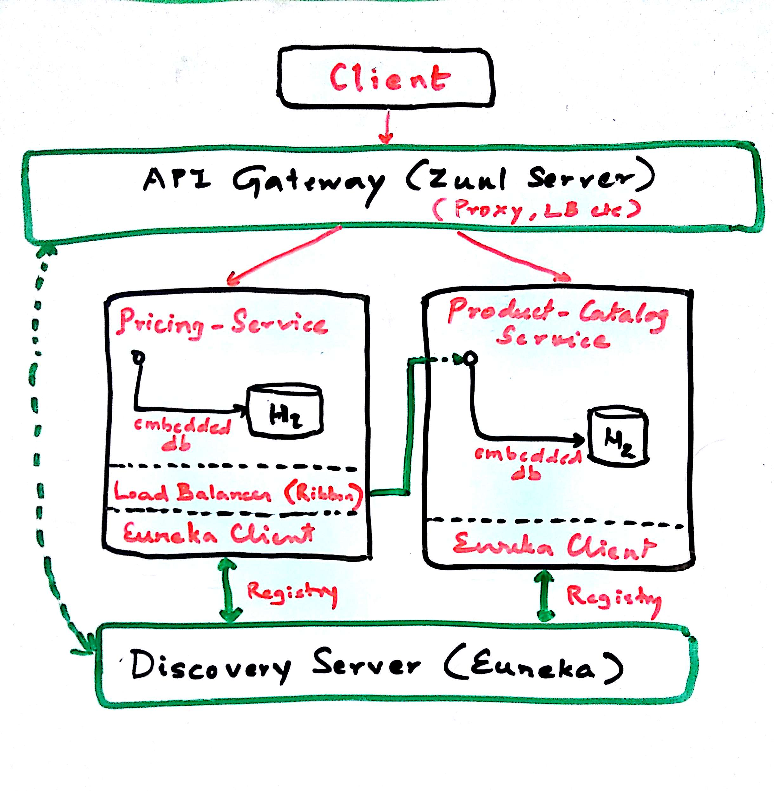

## Globomart Application
&nbsp;
&nbsp;

#### Project Introduction
It's a gradle project, load the project and generate wrappers:
~~~
$ gradle wrapper
~~~
The project is setup as modules like so:
~~~
globomart
|______ core
|           |____ product-catalog-service
|           |____ pricing-service
|
|______ support
            |____ api-gateway
            |____ discovery-server

~~~

&nbsp;
### Application and Support Services
 - **Core**: Application services that implement the globomart business logic. We have two services both exposing ReST APIs and using an embedded instance of H2 as the datastore.
 
**Product Catalog Service**

Microservice that provides the functionality to add a product, retrieve the list of products based on simple search criteria e.g. product type and remove a product from the catalog.
The APIs exposed by this service are:
~~~
GET    /products/    - gets all products as a list
POST    /products/    - creates a new product
GET    /products/name/{name}/type/{type}    - gets all products with given name and type as a list 
GET    /products/type/{type}    - gets all products with given type as a list
DELETE    /products/{id}    - deletes a product identified by the id
~~~
**Pricing Service**

Microservice that provides the functionality to return the price for a given product. The service makes a network call to get appropriate product information from the *Product Catalog Service* and subsequenctly fetches the price. The APIs exposed by this service are:
~~~
GET	/product-prices/name/{name}/type/{type}		gets the price of a product with given name and type
~~~
&nbsp;

- **Support**: Infrastructure Services that provide functionalities like service discovery, routing/proxy and load balancing.

**Discovery Server (Eureka)**

Stand-alone Spring Boot application provides service discovery and registration for failover and load-balancing. Both application services (*Product catalog and Pricing*) and the proxy server (*API Gateway*) register themselves as they are added. It also exposes a dashboard that lists all the service instances.
 
**API Gateway (Zuul)**

Gatekeeper to the outside world, not allowing any unauthorized external requests pass through. Also provides a well known entry point to the microservices in the system landscape. Using dynamically allocated ports is convenient to avoid port conflicts and to minimize administration but it makes it of course harder for any given service consumer. Zuul uses Ribbon to lookup available services and routes the external request to an appropriate service instance.

**Additional : Load balancer (Ribbon)**

Used by service consumers to lookup services at runtime. Ribbon uses the information available in Eureka to locate appropriate service instances. If more than one instance is found, Ribbon will apply load balancing to spread the requests over the available instances. Ribbon does not run as a separate service but instead as an embedded component in each service consumer.

&nbsp;
### Exeution
Steps to bring the services up (relevant for Linux environment, while the second method can be easily translated to Windows environment)

- Using Shell script (From the root of the project `globomart`)
~~~
$ chmod 755 run-all.sh
$ ./run-all.sh		# builds and runs all the services
~~~

- Individual steps (From the root of the project `globomart`)
~~~
# Discovery server, starts the service on port 8070
$ cd support/discovery-server;	./gradlew clean build;
$ nohup java -jar -Xms256m -Xmx256m build/libs/*-SNAPSHOT.jar &
$ cd -

# Product Catalog Service, starts the service on port 8001 (not exposed in production)
$ cd core/product-catalog-service;	./gradlew clean build;
$ nohup java -jar -Xms256m -Xmx512m build/libs/*-SNAPSHOT.jar &
$ cd -

# Pricing Service, starts the service on port 8002 (not exposed in production)
$ cd core/pricing-service;	./gradlew clean build;
$ nohup java -jar -Xms256m -Xmx512m build/libs/*-SNAPSHOT.jar &
$ cd -

# API Gateway, starts the service on port 8080
$ cd support/api-gateway;	./gradlew clean build;
$ nohup java -jar -Xms256m -Xmx256m build/libs/*-SNAPSHOT.jar &
$ cd -

~~~

&nbsp;
### In Action
- Eureka Dashboard
Exposed on http://localhost:8070/. Lists all registered services.

- Testing the APIs
All requests are routed through the API gateway that translates the paths to respective service IPs and ports and forwards the request.
Path exposed to the client is via port 80: http://localhost:8080/
~~~
# GET list of products
curl -i -H "Accept: application/json" -H "Content-Type: application/json" -X GET "http://localhost:8080/product-catalog/products"

# GET list of products with a given type
curl -i -H "Accept: application/json" -H "Content-Type: application/json" -X GET "http://localhost:8080/product-catalog/products/type/motherboard"

# GET the price of a product
curl -i -H "Accept: application/json" -H "Content-Type: application/json" -X GET "http://localhost:8080/pricing/product-prices/name/Intel%20Core%20i5-7500%20Processor/type/processor"

~~~

&nbsp;
### Schema Creation and Migration
Flyway is used for schema migration.

&nbsp;
### Unit Tests
Service unit tests are present in the respective modules.

&nbsp;
### Swagger API Documentation
Rest APIs have been document using Swagger2 utility. It will generate a navigable UI once the services are up.

#### Product Catalog Service
Navigate to http://localhost:8080/product-catalog/swagger-ui.html

#### Pricing Service
Navigate to http://localhost:8080/pricing/swagger-ui.html
